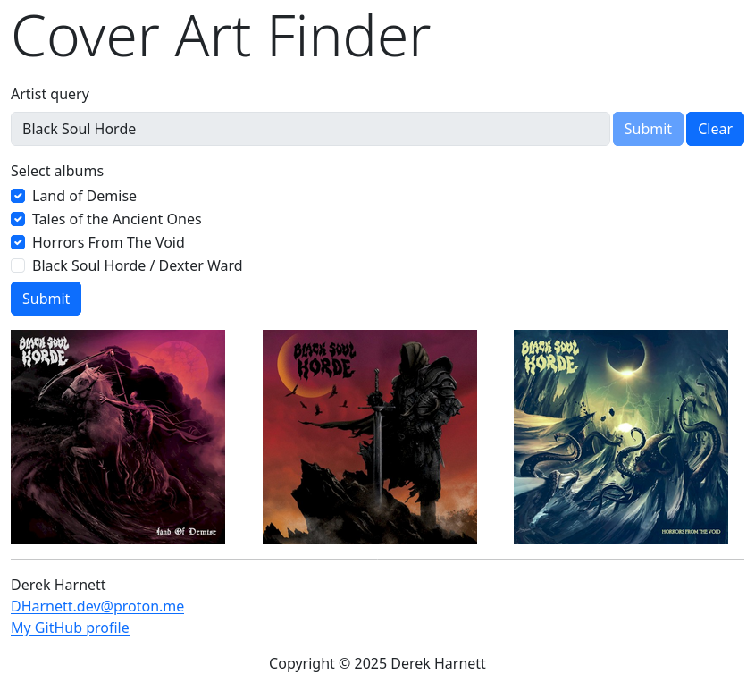

# Cover Art Finder

## Overview

Through API calls to [MusicBrainz](https://musicbrainz.org/doc/MusicBrainz_API) and [Cover Art Archive](https://coverartarchive.org/), this app displays front covers of releases of a user-determined artist.

## Screenshot



## Install

To run this app, you'll need to first install [node.JS](https://nodejs.org/en). Then, clone the repo, enter the `cover-art-finder` directory, and install with

```bash
$ npm install
```

## Usage

Run the server with

```bash
$ node index.js
```

and point your browser to `localhost:3000/`. Enter the name of an artist to search for. If the result of the search yields more than one artist, you'll need to check the appropriate radio button corresponding to the correct choice. Then, select the albums for which you'd like to display cover art.
